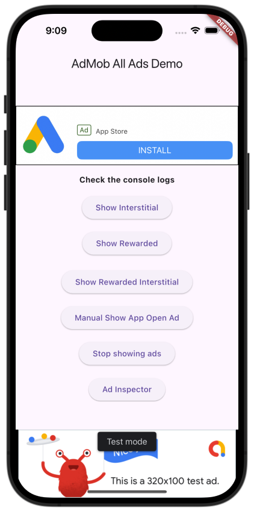
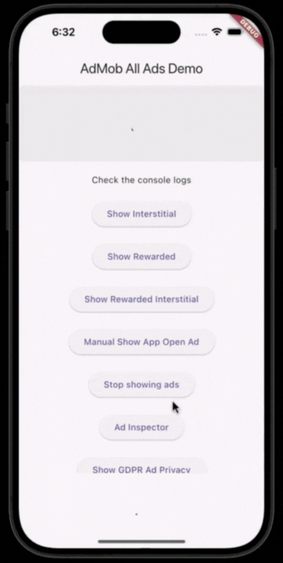
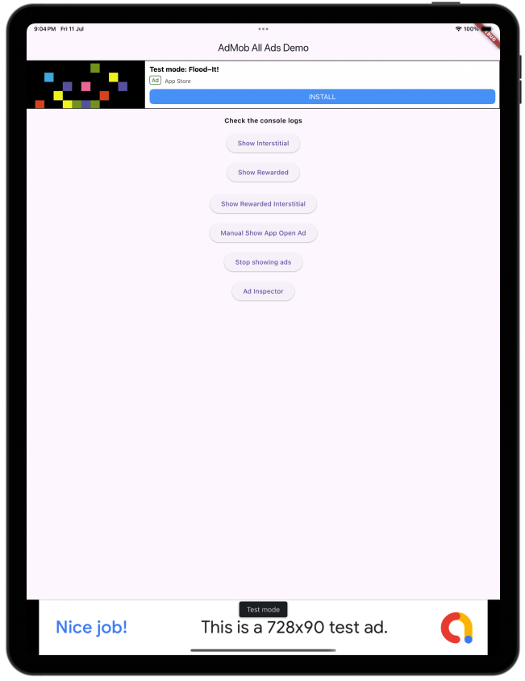

[](https://thebsd.github.io/StandWithPalestine)

# Easy AdMob Integration for Flutter

[](https://pub.dev/packages/easy_admob_ads_flutter)

[](https://github.com/huzaibsayyed/easy_admob_ads_flutter/commits/main)
[](https://github.com/huzaibsayyed/easy_admob_ads_flutter/pulls)
[](https://github.com/huzaibsayyed/easy_admob_ads_flutter)
[](https://github.com/huzaibsayyed/easy_admob_ads_flutter/blob/main/LICENSE)

**Show some ❤️ by giving the [repo](https://github.com/huzaibsayyed/easy_admob_ads_flutter) a ⭐ and liking 👍 the package on [pub.dev](https://pub.dev/packages/easy_admob_ads_flutter)!**

## Screenshots
<p float="left">
  
  
  
</p>

## Features

This package simplifies integrating multiple AdMob ad formats in your Flutter apps, including:

* Banner
* Interstitial
* Rewarded
* Rewarded Interstitial
* App Open Ads
* Native Ads

Also includes built-in support for GDPR consent using Google's User Messaging Platform (UMP), ensuring compliance in GDPR-affected regions.

## Getting Started

To get started with `easy_admob_ads_flutter`, follow the steps below to integrate AdMob ads into your Flutter app.


### 1. Install the package

Add the dependency in your `pubspec.yaml`:

```yaml
dependencies:
  easy_admob_ads_flutter: ^<latest_version>
```

> Replace `<latest_version>` with the latest version on [pub.dev](https://pub.dev/packages/easy_admob_ads_flutter)

**OR** install it directly via terminal:

```bash
flutter pub add easy_admob_ads_flutter
```

### 2. Configure platform-specific AdMob setup

#### Android

* Open your `android/app/src/main/AndroidManifest.xml`
* Add your AdMob App ID inside the `<application>` tag:

```xml
<meta-data
  android:name="com.google.android.gms.ads.APPLICATION_ID"
  android:value="ca-app-pub-xxxxxxxxxxxxxxxx~yyyyyyyyyy"/>
```

#### iOS

* Open your `ios/Runner/Info.plist` and add:

```xml
<key>GADApplicationIdentifier</key>
<string>ca-app-pub-xxxxxxxxxxxxxxxx~yyyyyyyyyy</string>
```

### 3. Initialize the SDK and pass your Ad Unit IDs

Inside your `main.dart`:

```dart
void main() async {
  // Ensure platform bindings are initialized before any async calls
  WidgetsFlutterBinding.ensureInitialized();

  // Set your actual AdMob App IDs in AndroidManifest.xml and Info.plist:
  // Android: https://developers.google.com/admob/flutter/quick-start#android
  // iOS:    https://developers.google.com/admob/flutter/quick-start#ios

  // Sets up global logging for Easy Admob Ads Flutter Package
  AdHelper.setupAdLogging();

  // Initialize ad unit IDs for Android and/or iOS (required for at least one)
  // Leave any value as an empty string ("") to skip that ad type.
  AdIdRegistry.initialize(
    ios: {
      AdType.banner: 'ca-app-pub-3940256099942544/8388050270', // Test ID
      AdType.interstitial: 'ca-app-pub-3940256099942544/4411468910', // Test ID
      AdType.rewarded: 'ca-app-pub-3940256099942544/1712485313', // Test ID
      AdType.rewardedInterstitial: 'ca-app-pub-3940256099942544/6978759866', // Test ID
      AdType.appOpen: 'ca-app-pub-3940256099942544/5575463023', // Test ID
      AdType.native: 'ca-app-pub-3940256099942544/3986624511', // Test ID
    },
    android: {
      AdType.banner: 'ca-app-pub-3940256099942544/2014213617', // Test ID
      AdType.interstitial: 'ca-app-pub-3940256099942544/1033173712', // Test ID
      AdType.rewarded: 'ca-app-pub-3940256099942544/5224354917', // Test ID
      AdType.rewardedInterstitial: 'ca-app-pub-3940256099942544/5354046379', // Test ID
      AdType.appOpen: 'ca-app-pub-3940256099942544/3419835294', // Test ID
      AdType.native: 'ca-app-pub-3940256099942544/2247696110', // Test ID
    },
  );

  // Global Ad Configuration
  AdHelper.showAds = true; // Set to false to disable all ads globally
  // AdHelper.showAppOpenAds = true; // Set to false to disable App Open Ad on startup

  // AdHelper.showConstentGDPR = true; // Simulate GDPR consent (debug only, false in release)

  // Initialize Google Mobile Ads SDK
  await AdmobService().initialize();

  // Optional: Use during development to test if all ad units load successfully
  // await AdRealIdValidation.validateAdUnits();

  runApp(const MainApp());
}
```

See the full example in the [`example/`](https://github.com/huzaibsayyed/easy_admob_ads_flutter/blob/main/example/lib/main.dart) folder of this repository for complete usage of all ad types with interactive UI.

## Usage

After initializing AdMob and registering your ad unit IDs, you can use the following widgets and classes to display ads:

### Banner Ad

```dart
AdmobBannerAd(collapsible: true, height: 100)
```

### Native Ad

```dart
AdmobNativeAd.medium()
```

### Interstitial Ad

```dart
final interstitialAd = AdmobInterstitialAd();
interstitialAd.loadAd();
interstitialAd.showAd();
```

### Rewarded Ad

```dart
final rewardedAd = AdmobRewardedAd(
  onRewardEarned: (reward) {
    // Grant the user a reward
  },
);
rewardedAd.loadAd();
rewardedAd.showAd();
```

### Rewarded Interstitial Ad

```dart
final rewardedInterstitialAd = AdmobRewardedInterstitialAd(
  onRewardEarned: (reward) {
    // Grant reward here
  },
);
rewardedInterstitialAd.loadAd();
rewardedInterstitialAd.showAd();
```

### App Open Ad

```dart
final appOpenAd = AdmobAppOpenAd();
appOpenAd.loadAd();
appOpenAd.showAdIfAvailable();
```

You can also control when App Open ads show automatically using: `AdHelper.showAppOpenAds = true;`

### GDPR Consent (UMP)

```dart
final consentManager = ConsentManager();

if (AdHelper.isPrivacyOptionsRequired) ...[
SizedBox(height: 15),
ElevatedButton(
  onPressed: () {
    _consentManager.showPrivacyOptionsForm((formError) {
      if (formError != null) {
        debugPrint("${formError.errorCode}: ${formError.message}");
      }
    });
  },
  child: Text("Show GDPR Ad Privacy"),
),
```

This ensures GDPR compliance using Google’s User Messaging Platform (UMP). Use `AdHelper.showConstentGDPR = true` in debug builds to simulate consent for testing.

## Author

##### Huzaib Sayyed

[](https://github.com/huzaibsayyed) [](https://www.linkedin.com/in/huzaif7)